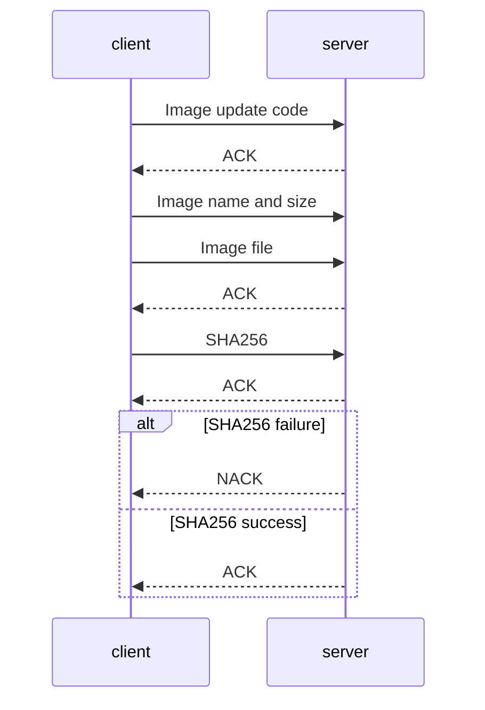

# Common packages

This folder includes all the packages which are common between both the embedded device and the webserver

## TCP_Protocol

This package manages the transfer of files from one device (client) to another (server); so long as I have the definitions the correct way around...

The files are transfered using the following protocol:
